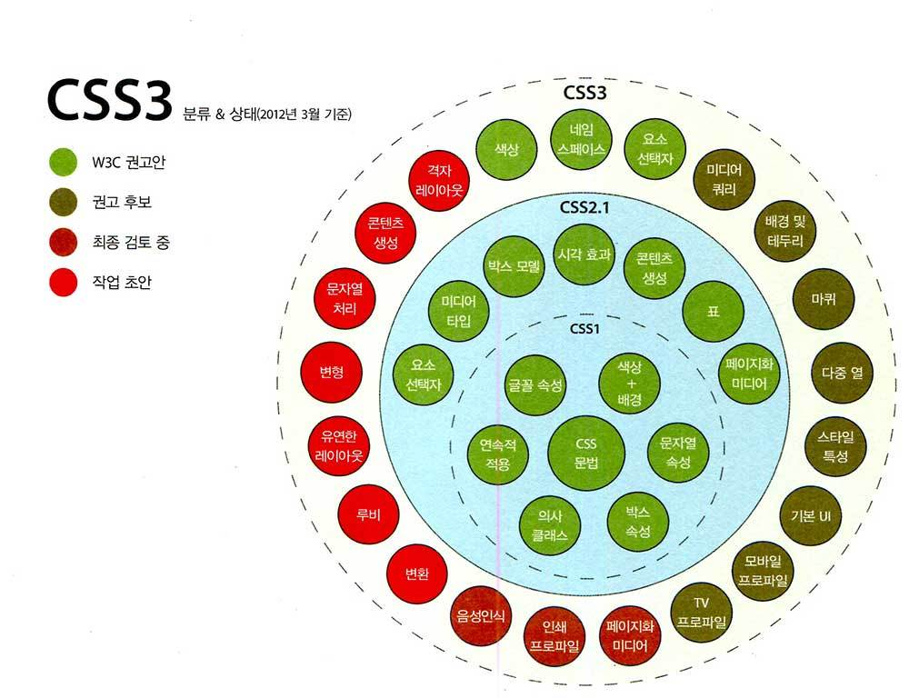
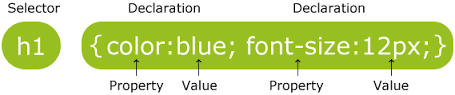

# CSS(Cascading Style Sheet)

## CSS 정의
    CSS는 Cascading Style Sheet의 약자이다. CSS는 문서의 콘텐츠와 레이아웃, 글꼴 및 시각적 요소들로 표현되는 문서의 외관(디자인)을 분리하기 위한 목적으로 만들어졌으며, w3c 라는 기관에서 제정한 웹 문서의 스타일을 지정하도록 하는 언어이다.

## CSS 레벨
    CSS 명세는 World Wide Web Consortium에서 관리한다. CSS는 세 개의 주 레벨이 정의되어 있고 이 레벨들은 버전이나 세대라고 볼 수 있으며, 현재 CSS1, CSS2 및 CSS3가 정의되어 있다.

    

## CSS 선택자(Selecter)
    CSS 선택자(Selecter) 는 스타일 부여할 대상을 정해주는 것을 의미하며, 스타일 적용시킬 요소(Tag=Element)를 반드시 정해주어야만 원하는 요소에 지정한 속성의 스타일이 부여된다.

## CSS 속성(Properties)
    CSS 속성은 해당 요소에 주어야 하는 모양이나 특성의 키워드를 말하며, 하나의 선택된 요소(Tag)에 여러 속성 값이 지정될 수 있으며, 속성이 지정되지 않으면, 해당 속성의 기본값이 적용된다.

## CSS 내에서의 각주
    CSS 부여시에 스타일 부여에는 아무런 영향을 미치지 않고, 추가적인 부연 설명이 필요한 경우 붙는 문장을 의미하며, '/*'' 로 시작하여  '*/'로 끝을 닫는다.

## CSS 스타일 지정 방식
    지정하고 싶은 스타일의 내용을 어디에 기재할 지에 따라 외부 스타일 지정, 내부 스타일 지정, 인라인 스타일 지정방식으로 나눈다.

### 외부 스타일 지정 방식
    link 요소(태그)나 @import 규칙으로 웹 문서 스타일이 적힌 별도의 스타일(css) 파일을 연결하게 그 스타일의 내용이 적용될 수 있도록 하는 방식으로서 하나의 외부 스타일 파일을 작성하게 되면, 다른 여러 웹(html) 문서에 반복적으로 적용할 수 있어, 그 만큼 시간을 절약할 수 있는 장점이 있다.
```html
<head>
    <link href="style.css" rel="stylesheet" type="text/css">
</head>
```   
```html
<head>
    <style>
    @import url(style.css);
    </style>
</head>
```

### 내부 스타일 지정 방식
    해당 하는 웹 문서에 style 요소(태그)의 여는 태그(<style>)와 닫는 태그(</style>) 사이에 스타일의 내용을 적어 현재 문서에만 스타일 적용할 경우에 사용하는 방식
```html
<head>
  <style>
  .logo { color:res;} 
  </style>
</head>
```

### 인라인 스타일 지정 방식
    스타일을 지정하고 싶은 요소(태그)에 직접 style 속성으로 원하는 스타일의 속성과 값을 입력하여 지정하는 방식으로 가급적 사용하지 않는 것이 스타일의 유동성 측면에서 좋다. 왜냐하면, 인라인 스타일로 지정된 스타일 내용은 그 내용을 내부 스타일 지정 방식이나 외부 스타일 지정 방식으로 변경을 할 수 없으므로 나중에라도 스타일 변경할 수 없어 스타일 제어하기가 곤란하기 때문이다.
```html
<body>
  <span style="height:100px; color:blue">인라인</span> 스타일 지정 방식
</body>
```

## CSS 기본 문법
    
    CSS의 기본 규칙은 선택자(Selecter)와 선언부(Declaration)로 나뉘며, 다시 선언부는 속성(Property)와 그 속성에 대한 값(value)로 나누어 입력하게 된다.
    - 맨 앞에 선택자(Selecter)가 위치하고, 그 뒤에 선언부(Declaration)인 중괄호({}) 블록이 놓여지게 되며, 속성이 여러 개 일 경우는 "속성:값;" 을 여러 개 입력하고, 해당 속성의 값이 끝나면, 반드시 세미콜론(";")을 붙이며, 가장 끝의 속성의 값에는 세미콜론의 생략이 가능하다. 또한, 해당 속성에 대한 값이 여러 개 인 경우는 콤마(",")로 구분하여 여러 값을 지정할 수도 있다.

## CSS 선택자의 우선 순위
    !important > 인라인 스타일 > 아이디 선택자 > 클래스/속성/가상 선택자 > 태그 선택자 > 전체 선택자

    - 


